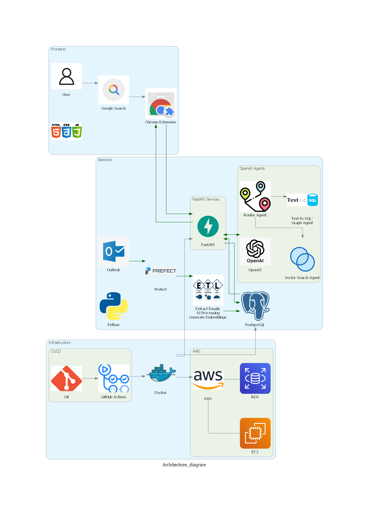

# AI-Powered Outlook Job Tracker


## Tech Stack

### Backend & AI
- **Framework**: FastAPI
- **Language**: Python
- **Database**: PostgreSQL with pgvector extension
- **AI Model**: OpenAI GPT-4o
- **Data Orchestration**: Prefect
- **Containerization**: Docker & Docker Compose

### Frontend
- **Chrome Extension**: JavaScript, HTML, CSS
- **UI Components**: Custom popup interface

### Infrastructure & DevOps
- **Cloud Platform**: AWS (EC2, RDS)
- **CI/CD**: GitHub Actions
- **Version Control**: Git

## Overview
The AI-Powered Outlook Job Tracker is a sophisticated Chrome extension integrated with a FastAPI backend that helps users track their job applications intelligently. The system automatically processes Outlook emails to maintain application records and provides real-time notifications when users visit companies they've previously applied to. The solution leverages advanced AI capabilities for natural language querying and data visualization.

## System Architecture

*High-level architecture showing system components and data flow*

## Architecture
The system follows a microservices architecture with the following components:

### Chrome Extension (Frontend)
- Real-time company website detection
- Dynamic popup UI for application status display
- Natural language query interface
- Interactive data visualization dashboard

### FastAPI Backend
- RESTful API endpoints:
  - `/check_url`: Company application status verification
  - `/get_user_query`: AI-powered query processing
- Multi-agent AI system:
  - **Agent 1**: Query classification and routing
  - **Agent 2**: Vector similarity search for company-specific queries
  - **Agent 3**: Text-to-SQL/Graph conversion for analytics

### Automated Data Pipeline
- 24-hour Prefect scheduler for:
  - Outlook email data extraction
  - Data cleaning and preprocessing
  - GPT-powered data processing
  - PostgreSQL data ingestion
  - Vector embedding generation

## Features

### Intelligent Company Detection
- Automatic detection of company websites
- Real-time application status notifications
- Detailed application history display

### AI-Powered Analytics
- Natural language querying capability
- Company-specific application insights
- Statistical analysis and visualization
- Vector similarity search for accurate company matching

### Automated Data Management
- Automated email processing
- Intelligent data categorization
- Regular database updates
- Vector embedding maintenance

## Local Development Setup

1. **Clone the Repository**
```bash
git clone https://github.com/Sukruthmothakapally/outlook-AI-jobtracker-chrome-extension.git
cd outlook-AI-jobtracker-chrome-extension
```

2. **Environment Configuration**
```bash
cp .env.example .env
```

Update your `.env` file with the following configurations:

```bash
# PostgreSQL Connection Details
DB_HOST_NAME=''  # Your database host (e.g., localhost or RDS endpoint)
MAINTENANCE_DB=''  # Database name
DB_USERNAME=''  # Database username
DB_PASSWORD=''  # Database password

# OpenAI Configuration
OPENAI_API_KEY=''  # Your OpenAI API key

# Microsoft Outlook API Configuration
APP_ID=''  # Microsoft Azure App Registration ID
SCOPES=['User.Read', 'Mail.Read']  # Required Microsoft Graph API permissions
TOKEN_FILE=''  # Path to save OAuth token

# Note: To obtain APP_ID and configure TOKEN_FILE:
# 1. Register an application in Azure Active Directory
# 2. Go to Azure Portal -> App Registrations
# 3. Create a new registration
# 4. Copy the Application (client) ID
# 5. Configure redirect URIs
# 6. Add API permissions for Mail.Read and User.Read
# 7. TOKEN_FILE will be automatically generated after first authentication
```

3. **Database Setup**

Before running the application, initialize the database schema:

```bash
# Connect to your PostgreSQL instance
psql -U your_username -d your_database -h your_host

# Run the initialization script
\i db_scripts/db_script.sql
```

4. **Docker Setup**
```bash
# Build and start all services
docker-compose up --build

# To stop services
docker-compose down
```

5. **Chrome Extension Setup**:
   - Open Chrome, go to `chrome://extensions/`, and enable **Developer mode**.
   - Click on **Load unpacked** and select the `chrome_extension` directory from this repository.
   - Once loaded, the extension will be active. Visit a company website to see if the extension displays application information.

## Production Deployment

The system is deployed on AWS with the following components:
- Dockerized FastAPI and Prefect running on EC2 instances
- PostgreSQL hosted on AWS RDS
- Automated deployments via GitHub Actions

### Deployment Process
1. Push changes to develop branch
2. GitHub Actions automatically:
   - Runs tests
   - Builds Docker images
   - Deploys to EC2
   - Updates containers
   - Performs health checks

## API Documentation

### Main Endpoints

#### Check URL
```http
POST /check_url
```
Params:
- `url`: Current website URL

Returns:
- Application status and details if company match found

#### User Query
```http
POST /get_user_query
```
Body:
- `query`: Natural language query string

Returns:
- Query results (SQL data or visualization)

## License

MIT License - see the [LICENSE.md](LICENSE.md) file for details